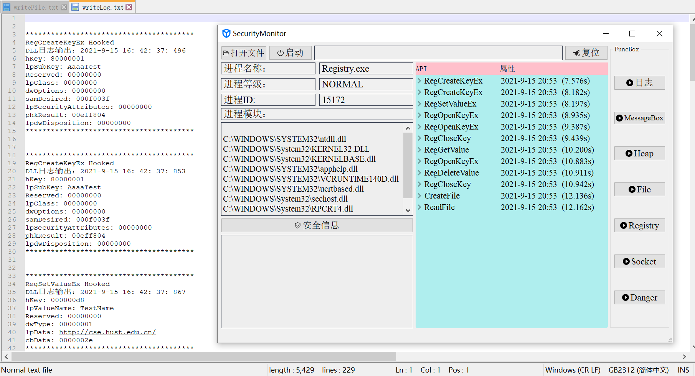
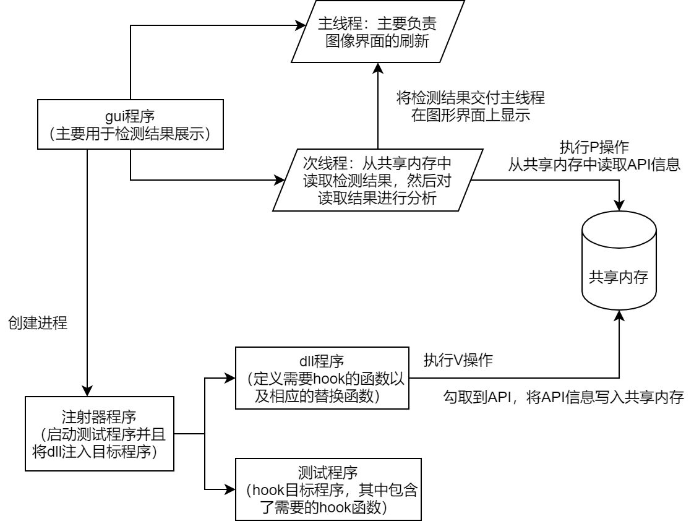

# SecurityMonitor
A HUST-CSE SoftSecurity Design
华中科技大学网安学院软安课设

## 1. Get start

### 1.1 Intrduction

There are some parts in the project：

- Dll (include [InjectDll.dll])
- Syringe (include [TestConsole.exe])
- A Menue for all functions (include FuncMenu[TestExe.exe])
- Many Functions' Tests (include [MessageBox.exe, Heap.exe, File.exe, Registry.exe, Server.exe and Client.exe])

All the [.exe, .dll] result files are in the filepath[./InjectDll/Debug/*.exe].

- Qt GUI (SafeMonitor Main UI)

The GUI is in the filepath[.\SecurityMonitor\SecurityMonitor\SecurityMonitor.pro], you can run it in Qt 5.14.

## 2 Run it

Running Environment：

* detours lib: [configuration](https://blog.csdn.net/weixin_44338712/article/details/115261358)
* QT 5.14
* Visual Studio 2019 (Community)
* Windows 10

<b>Need to modify the FilePath!!!</b>
e.g. `E:\TestInitialNullForStudent\InjectDll\Debug\xxx.exe` needs to be modified to your own FilePath.

Then run it.

## 2. Process Picture

## 3. Concrete Explaination

### 3.1 Total Idea

Just like the figure shows:

### 3.2 HOOK API

Mainly completed below 18 `winAPI's HOOK`，about `MessageBox API`, `File Operation API`, `Heap Operation API`, `Registry Operation API`, `socket API` etc.

~~~cpp
DetourAttach(&(PVOID&)OldMessageBoxW, NewMessageBoxW);
DetourAttach(&(PVOID&)OldMessageBoxA, NewMessageBoxA);
DetourAttach(&(PVOID&)OldCreateFile, NewCreateFile);
DetourAttach(&(PVOID&)OldWriteFile, NewWriteFile);
DetourAttach(&(PVOID&)OldReadFile, NewReadFile);
DetourAttach(&(PVOID&)OldHeapCreate, NewHeapCreate);
DetourAttach(&(PVOID&)OldHeapDestory, NewHeapDestory);
DetourAttach(&(PVOID&)OldHeapFree, NewHeapFree);
DetourAttach(&(PVOID&)OldRegCreateKeyEx, NewRegCreateKeyEx);
DetourAttach(&(PVOID&)OldRegSetValueEx, NewRegSetValueEx);
DetourAttach(&(PVOID&)OldRegGetValue, NewRegGetValue);
DetourAttach(&(PVOID&)OldRegDeleteValue, NewRegDeleteValue);
DetourAttach(&(PVOID&)OldRegCloseKey, NewRegCloseKey);
DetourAttach(&(PVOID&)OldRegOpenKeyEx, NewRegOpenKeyEx);
DetourAttach(&(PVOID&)Oldsocket, Newsocket);
DetourAttach(&(PVOID&)Oldbind, Newbind);
DetourAttach(&(PVOID&)Oldsend, Newsend);
DetourAttach(&(PVOID&)Oldrecv, Newrecv);
~~~

### 3.3 Abnormal Behavior Analysis

Mainly completed 5 abnormal behavior analysis:

- Modify Executable File (.exe .dll .ocx)
- Self replication
- Open Mutiple Folders
- Heap Free Repeatedly
- Modify StartUp Registry (SOFTWARE\Microsoft\Windows\CurrentVersion\Run)

